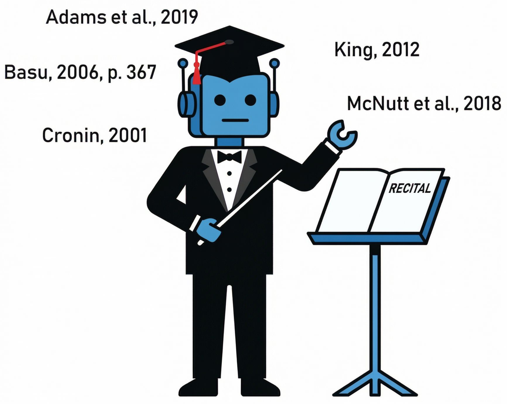

# RECITAL

**Revisión Electrónica de Citas, Identificación Textual Académica y Listados de referencias**

RECITAL es un validador editorial para la **revisión temprana** de manuscritos científicos.
Esta versión está orientada específicamente al trabajo de **editores científicos de revistas universitarias** durante las primeras etapas del flujo editorial (pre-chequeo técnico y pre-evaluación).

## Alcance actual de esta versión

- Validación de correspondencia entre citas en texto y listado final de referencias.
- Identificación de citas sin referencia y referencias no citadas.
- Detección de citas candidatas para revisión manual.
- Vinculación interactiva cita ↔ referencia desde la interfaz.
- Panel de métricas (citas totales, correctas, sin referencia, etc.).
- Navegación por incidencias con botones de salto rápido.
- Exportación del resultado de revisión a `.doc`.

## Nota crítica de norma

> **Esta versión está afinada únicamente para APA 7.**
>
> No debe considerarse un validador confiable para otras normas (Vancouver, IEEE, MLA, Chicago, etc.) sin adaptación específica.

## Archivos realmente implicados en la ejecución

Para ejecutar la app actual, los elementos efectivos son:

- `recital(v.1).html` (interfaz principal y lógica de soporte inline).
- `recital-v1.js` (lógica principal activa cargada por script externo).
- Recurso externo `mammoth.browser.min.js` vía CDN (para lectura de `.docx`).
- Recursos visuales remotos usados por URL (logos institucionales).

### Recurso de imagen en documentación

- `assets/recital-orquesta.PNG` (imagen de portada del README y del PDF documental).

## Uso rápido

1. Abre `recital(v.1).html` en navegador.
2. Carga archivo `.docx` o `.txt`.
3. Revisa incidencias y corrige vínculos cita-referencia.
4. Exporta el informe/resultado cuando sea necesario.

## Dependencia funcional

- [Mammoth.js](https://github.com/mwilliamson/mammoth.js) para parseo de DOCX.

## Licencias de terceros

- Consulta [THIRD_PARTY_LICENSES.md](THIRD_PARTY_LICENSES.md) para el detalle de bibliotecas externas y atribuciones.

## Licencia

Este proyecto publica su **código** bajo licencia [MIT](LICENSE).

### Excepción sobre marcas, logos e identidad visual

Los logos institucionales, marcas, nombres comerciales e identidad gráfica mostrados o enlazados en la aplicación/documentación **no** se ceden bajo MIT y mantienen los derechos de sus titulares.

- Puedes reutilizar/modificar el código según MIT.
- Para redistribuir en producción, se recomienda sustituir logos/marcas por recursos propios o con permisos explícitos.

